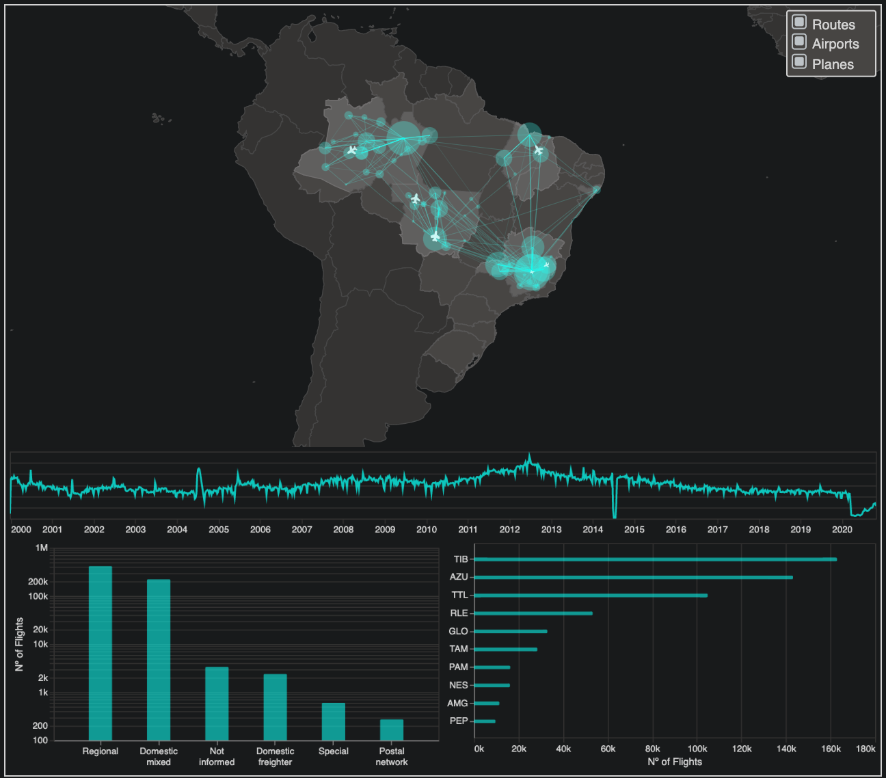

# Brazil Flights

This repository contains the implementation of an interactive visualization of Brazilian flights ranging from January 2000 to October 2020. It's a final exam project for the data visualization course at the university École Polytechnique and was made by the students Aloysio Galvão Lopes and Igor Albuquerque Silva.

 The visualization is available at the following link: <http://brazil-flights.herokuapp.com/>.

The dataset that was utilized is freely available at ANAC's website: <https://www.anac.gov.br/assuntos/dados-e-estatisticas/historico-de-voos>.
